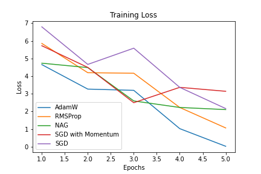
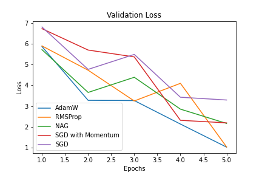

# BillSum Text Summarization

BillSum is the first dataset for summarization of US Congressional and California state bills.

The BillSum dataset consists of three parts: US training bills, US test bills and California test bills. The US bills were collected from the Govinfo service provided by the United States Government Publishing Office (GPO). The corpus consists of bills from the 103rd-115th (1993-2018) sessions of Congress. The data was split into 18,949 train bills and 3,269 test bills. For California, bills from the 2015-2016 session were scraped directly from the legislature’s website; the summaries were written by their Legislative Counsel.

AdamW optimizer with a learning rate of 2e-05, beta1 as 0.9, beta2 as 0.999 and epsilon as 1e-08 was used for all the models. A batch size of 8 was taken.

| Model      | ROUGE-1 | ROUGUE-2 | ROUGUE-L |
| ---------- | ------- | -------- | -------- |
| T5         | 38      | 12       | 22       |
| DistilBART | 40      | 17       | 25       |

- **Training loss**  
  

- **Validation loss**
   
  

The rate of convergence of the AdamW optimizer is the fastest.

We can conclude that the order of convergence of the optimizers:
AdamW > RMSprop > NAG > SGD(Momentum) > SGD.
